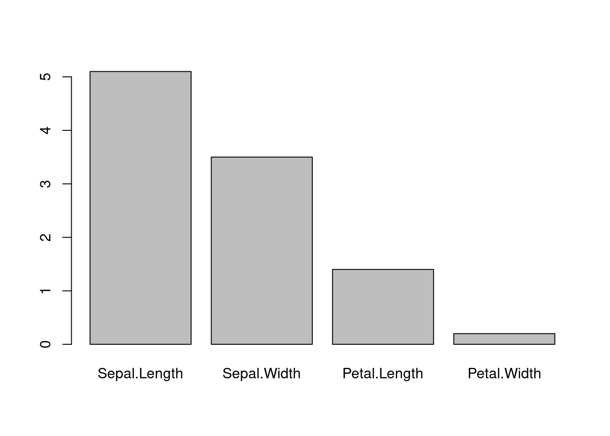
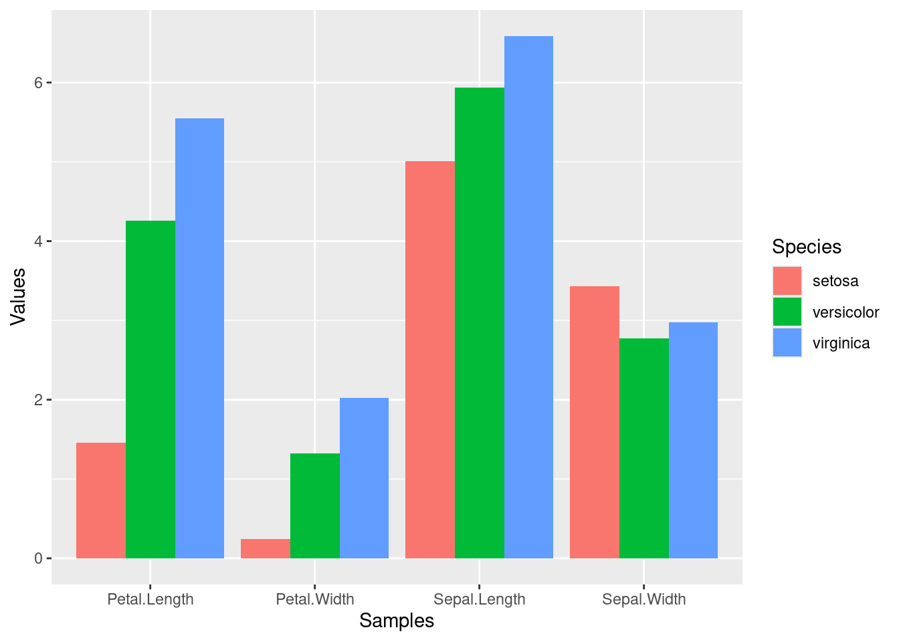

<!---
- Compile from command-line
Rscript -e "rmarkdown::render('Intro2R.Rmd', c('html_document'), clean=FALSE)"
-->

# Import of Table 

The following provides a very brief introduction to R using a tabular file as an example [@manualr]. 
As tabular file, a test data set within R called `iris` will be written to a file. After 
executing the following `write.table` command, a new file named `iris.tab` will appear in 
the File browser panel. From within RStudio Cloud this file can be downloaded with the 
Export option in the same panel. For learning purposes, also try this example with your
own tabular file, e.g. exported from Excel or Google Sheets.


``` r
write.table(iris, file="iris.tab", row.names=FALSE, quote=FALSE, sep="\t") 
```

Next, the exported sample file will be imported into R with the `read.delim` function. 
The data will be assigned to an object named `df`. The assignment operator `<-` will be
used for this. The class of the resulting object is a `data.frame`. Its dimensions can
be checked with the `dim` function, returning here 150 rows and 5 columns. To print only
the first 4 rows to the screen, one can use the subsetting operator `[1:4 , ]`.
With `[1:4, 1:2]` one can subset the object to the first 4 rows and first 2
columns.


``` r
df <- read.delim("iris.tab")
class(df)
```

```
## [1] "data.frame"
```

``` r
dim(df)
```

```
## [1] 150   5
```

``` r
df[1:4,]
```

```
##   Sepal.Length Sepal.Width Petal.Length Petal.Width Species
## 1          5.1         3.5          1.4         0.2  setosa
## 2          4.9         3.0          1.4         0.2  setosa
## 3          4.7         3.2          1.3         0.2  setosa
## 4          4.6         3.1          1.5         0.2  setosa
```

``` r
df[1:4, 1:2]
```

```
##   Sepal.Length Sepal.Width
## 1          5.1         3.5
## 2          4.9         3.0
## 3          4.7         3.2
## 4          4.6         3.1
```

## Nicer tables

To print nicer tables, in the R Markdown `html` report, the `kable` function from the knitr package can be used.


``` r
library(knitr)
kable(df[1:4,])
```


| Sepal.Length| Sepal.Width| Petal.Length| Petal.Width|Species |
|------------:|-----------:|------------:|-----------:|:-------|
|          5.1|         3.5|          1.4|         0.2|setosa  |
|          4.9|         3.0|          1.4|         0.2|setosa  |
|          4.7|         3.2|          1.3|         0.2|setosa  |
|          4.6|         3.1|          1.5|         0.2|setosa  |


# Basic Calculations

The following performs some basic calculations on the imported tabular file. First, the `df`
is converted to a numeric `matrix` named `ma`, and then the mean (sum) is calculated for the 
first row as well as for all rows using the `mean` and `rowMeans` functions, respectively.


``` r
ma <- data.matrix(df[,-5])
class(ma)
```

```
## [1] "matrix" "array"
```

``` r
ma[1:4,]
```

```
##      Sepal.Length Sepal.Width Petal.Length Petal.Width
## [1,]          5.1         3.5          1.4         0.2
## [2,]          4.9         3.0          1.4         0.2
## [3,]          4.7         3.2          1.3         0.2
## [4,]          4.6         3.1          1.5         0.2
```

``` r
mean(ma[1,])
```

```
## [1] 2.55
```

``` r
rowMeans(ma)[1:10] # prints first 10 of 150 values
```

```
##  [1] 2.550 2.375 2.350 2.350 2.550 2.850 2.425 2.525 2.225 2.400
```

``` r
rowSums(ma)[1:10] # prints first 10 of 150 values
```

```
##  [1] 10.2  9.5  9.4  9.4 10.2 11.4  9.7 10.1  8.9  9.6
```

# Basic Plots

The following creates a simple barplot for the first row in `ma` using the `barplot` function of base R.  


``` r
barplot(ma[1,])
```



# Nicer Plots with `ggplot2`

Much nicer plots can be generated with the `ggplot2` package. Additional examples for `ggplot2` functionalities can be found [here](https://rb.gy/2f9pr).


``` r
library(ggplot2)
df_mean <- aggregate(df[,1:4], by=list(Species=df$Species), FUN=mean)
df_mean
```

```
##      Species Sepal.Length Sepal.Width Petal.Length Petal.Width
## 1     setosa        5.006       3.428        1.462       0.246
## 2 versicolor        5.936       2.770        4.260       1.326
## 3  virginica        6.588       2.974        5.552       2.026
```

``` r
df_mean <- tidyr::pivot_longer(df_mean, !Species, names_to="Samples", values_to="Values")
p <- ggplot(df_mean, aes(Samples, Values, fill = Species)) + 
        geom_bar(position="dodge", stat="identity")
p
```



Plots can be saved to files in different graphics formats using the R functions with the corresponding
names, including: `pdf`, `svg`, `tiff`, `png`, `jpg`, etc. The file name is specified under the
the first argument (here `myplot.png`).


``` r
png("myplot.png")
p
dev.off()
```

```
## png 
##   2
```

# Important Utilities

## Help

The help files for R functions can be opened by typing `?` followed by the name of the functions.
For instance, `?t.test` will open the help file for the Student's t-Test function in R.

## Packages

Many R packages (libraries) can be installed with the `install.packages` or the `BiocManager::install` functions. Before a package can be used, it needs to be loaded with the `library` function. Most of the relevant details for package installs are explained [here](https://rb.gy/8yl3y).

## Tutorials

Many tutorials and books are available for learning R. Here is a detailed [tutorial](https://girke.bioinformatics.ucr.edu/GEN242/tutorials/rbasics/rbasics/) 
of the UCR GEN242 class. Additional tutorials are linked on this  [page](https://pairach.com/2012/02/26/r-tutorials-from-universities-around-the-world/).


# Session Info


``` r
sessionInfo()
```

```
## R version 4.4.1 (2024-06-14)
## Platform: x86_64-pc-linux-gnu
## Running under: Debian GNU/Linux 12 (bookworm)
## 
## Matrix products: default
## BLAS:   /usr/lib/x86_64-linux-gnu/blas/libblas.so.3.11.0 
## LAPACK: /usr/lib/x86_64-linux-gnu/lapack/liblapack.so.3.11.0
## 
## locale:
##  [1] LC_CTYPE=en_US.UTF-8       LC_NUMERIC=C               LC_TIME=en_US.UTF-8        LC_COLLATE=en_US.UTF-8     LC_MONETARY=en_US.UTF-8    LC_MESSAGES=en_US.UTF-8    LC_PAPER=en_US.UTF-8       LC_NAME=C                 
##  [9] LC_ADDRESS=C               LC_TELEPHONE=C             LC_MEASUREMENT=en_US.UTF-8 LC_IDENTIFICATION=C       
## 
## time zone: America/Los_Angeles
## tzcode source: system (glibc)
## 
## attached base packages:
## [1] stats     graphics  grDevices utils     datasets  methods   base     
## 
## other attached packages:
## [1] ggplot2_3.5.1 knitr_1.47   
## 
## loaded via a namespace (and not attached):
##  [1] vctrs_0.6.5       cli_3.6.3         rlang_1.1.4       xfun_0.45         highr_0.11        purrr_1.0.2       generics_0.1.3    jsonlite_1.8.8    labeling_0.4.3    glue_1.7.0        colorspace_2.1-0  htmltools_0.5.8.1
## [13] sass_0.4.9        fansi_1.0.6       scales_1.3.0      rmarkdown_2.27    grid_4.4.1        evaluate_0.24.0   munsell_0.5.1     jquerylib_0.1.4   tibble_3.2.1      fastmap_1.2.0     yaml_2.3.8        lifecycle_1.0.4  
## [25] compiler_4.4.1    dplyr_1.1.4       pkgconfig_2.0.3   tidyr_1.3.1       farver_2.1.2      digest_0.6.36     R6_2.5.1          tidyselect_1.2.1  utf8_1.2.4        pillar_1.9.0      magrittr_2.0.3    bslib_0.7.0      
## [37] withr_3.0.0       tools_4.4.1       gtable_0.3.5      cachem_1.1.0
```

# References
