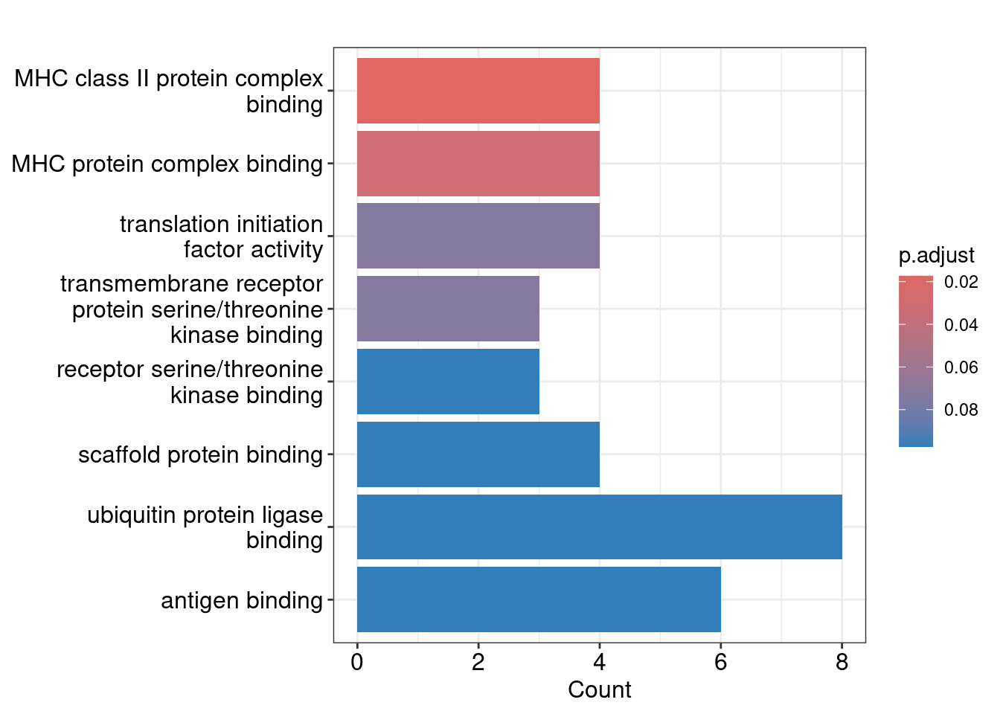
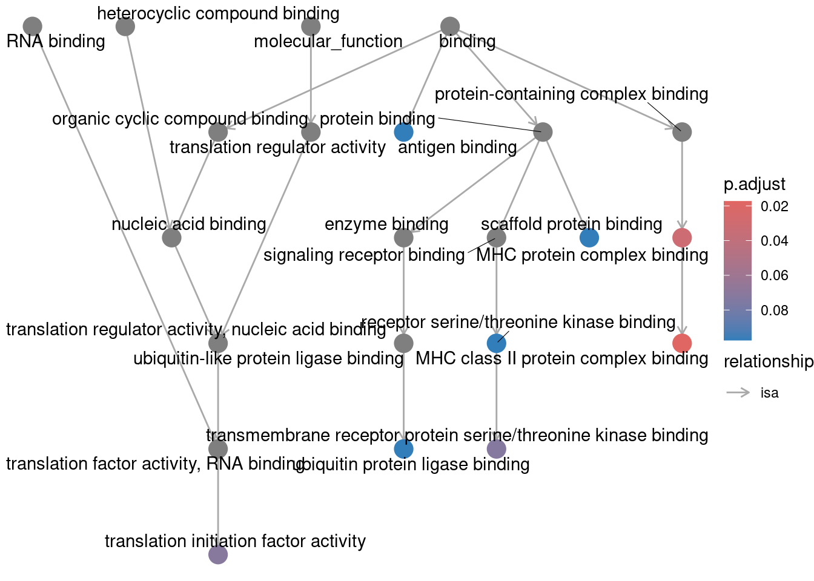
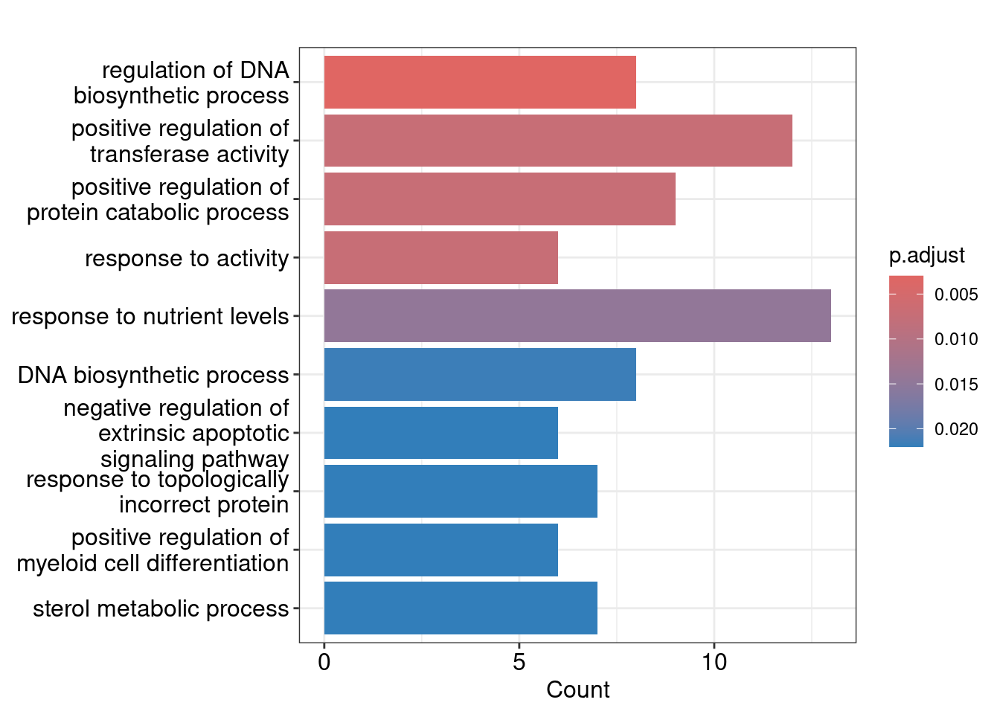
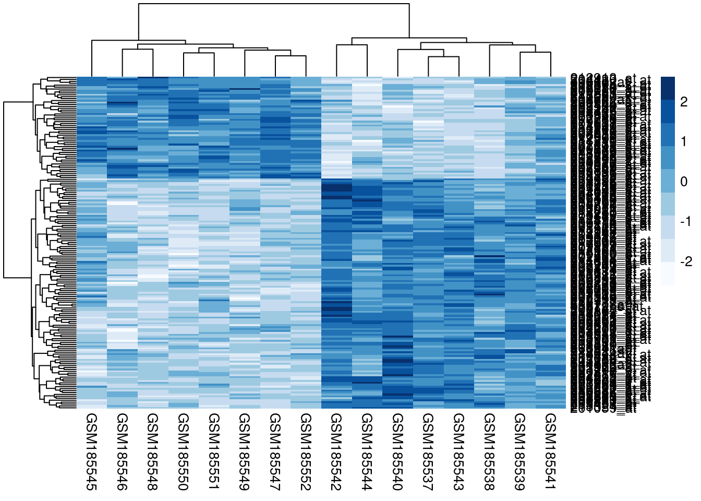

<!---
- Compile from command-line
Rscript -e "rmarkdown::render('exprAnalyisDemo.Rmd', c('html_document'), clean=FALSE)"
-->

# Get started 

The following provides brief instructions how to access RStudio Cloud (or
R/RStudio), clone the pre-generated project for this exercise, and run
the provided analysis code. The latter automatically downloads genome-wide expression data
from NCBI's GEO database, and then identifies:

+ differentially expressed genes (DEGs)
+ enriched GO terms
+ clusters of co-expressed genes

## Initialize project 

To get started with [RStudio Cloud](https://rstudio.cloud/), users can follow the instructions below.
Instead of RStudio Cloud, more advanced users can install everything on their local computer
by first installing R from [CRAN](https://cran.r-project.org), and then the free version
of RStudio from [here](https://www.rstudio.com/products/rstudio/download/). Since the
usage of RStudio Cloud does not require any local software installs, this
method is recommended for users who are new to R. For more advanced users the
local install option is less restrictive and more flexible. In both cases the
user interfaces are extremely similar and the way to run R code is nearly
identical. 

### Simple link-based approach
Note, students who are entirely new to R should use this approach (1.1.1) instead of (1.1.2):

1. Create a free personal account on Posit (RStudio) Cloud
   [here](https://posit.cloud/). 
2. Next click the <span style="background-color: #f1c40f;">Posit (RStudio) Cloud assignment link</span></a> provided under the same name
   coding on the corresponding assignment page on Canvas
   [here](https://elearn.ucr.edu/courses/147748/assignments/750221). Note
   the latter page is private to this class.
3. Start the pregenerated assignment by clicking the `BIOL119_Expression_Analysis`. This will create a copy of the assignment in a student's account.  
4. Continue under section 1.2 and skip R package install under section 2.

### Clone assignment from GitHub
This alternative approach is for slightly more advanced R users.

1. Create a free personal account on RStudio Cloud
   [here](https://rstudio.cloud/). 
2. Go to RStudio Cloud [here](https://rstudio.cloud/projects/)
3. Select under blue _New Project_ menu: `New Project from Git Repository`
4. Provide this URL to clone BIOL119 repos: [https://github.com/tgirke/BIOL119.git](https://github.com/tgirke/BIOL119.git) 
5. Continue under section 1.2. Note, the initial R package installs under section 2 will be 
   required for this approach.

## Load R code and run it

The R code along with the human readable text in this document can be opened and executed as follows:

1. Open source `Rmd` file for this document by selecting in top menu: `File` ->
   `Open File` -> `exprAnalyisDemo.Rmd`. Alternatively, one can click the name of this 
   file in Posit's (RStudio's) file browser, usually located in the window on the bottom right. Either option
   will open the `Rmd` in the code editor window usually located in the top left window.
2. Execute code of the `Rmd` file line by line by placing the cursor on a line of R code 
   and then pressing on the keyboard `Ctrl + Enter`. This will send the corresponding code line
   to the R console (located on bottom left) and execute (run) the code. It is important to execute the
   lines in the order given in the `Rmd` file. Note, `Rmd` files are special `R` files that contain 
   both human readable text in markdown format as well as R code located in so called code chunk boxes 
   that are initialized and terminated with a tag line starting with three backtick (\`) characters. If an 
   `R` script instead of an `Rmd` script is used then everything works the same. However, 
   in an `R` script human readable text has to be initialized on each line with a comment (`#`) sign.

Alternatively, one can execute all code in this document at once simply by
pressing the triangle next to the Knit button above the code editor window in
RStudio, and then selecting `Knit to HTML`. This will not only execute the
code, but also regenerate this HTML document and update all output, tables and
figures generated by the evaluated R code chunks accordingly.  Similarly, one
can generate a PDF document instead. The environment that makes this possible
is called [R Markdown](https://rmarkdown.rstudio.com/).

# Install required packages

The following will install all packages required for this exercise. A fresh
install into a new R project will take about 2-3 minutes. This install only
needs to be done once, meaning users want to skip this step after restarting R
or rerunning the analysis. Users who have loaded the pre-configured assignment
project into their RStudio Cloud account under section 1.1.1 can skip this
initial package install since a classroom project comes with all packages 
preinstalled.


``` r
if(!requireNamespace("BiocManager", quietly = TRUE)) install.packages("BiocManager")
BiocManager::install(c("GEOquery", "limma", "clusterProfiler", "org.Hs.eg.db", "enrichplot", "pheatmap", "RColorBrewer", "rmarkdown"))
```

# Import data from GEO

The following uses the `GEOquery` package to automatically download from GEO a
expression data set that involves a chemical treatment. The specific data set
chosen for this exercise is experiment
[GDS2778](https://www.ncbi.nlm.nih.gov/sites/GDSbrowser?acc=GDS2778), which is the 
same one used for the online exercises of computer section SA5 of BIOL119. This
Affymetrix gene expression profiling experiment from Gillis _et al._
[-@Gillis2007-qk] aims to study the effect of the air pollutant
1,2,4-benzenetriol on blood cells to provide insight into the molecular basis
of benzene cytotoxicity.  More detailed annotation information about this
experiment is available under Reference Series
[GSE7664](https://www.ncbi.nlm.nih.gov/geo/query/acc.cgi?acc=GSE7664). 


``` r
library(GEOquery) 
gds <- getGEO("GDS2778") # Download GDS2778 data from GEO
eset <- GDS2eSet(gds)
```

The experimental design information can be returned with the `pData` function. This includes
sample names, and control, treatment and replicate information.


``` r
pData(eset)[ ,1:2] 
```

```
##              sample              agent
## GSM185545 GSM185545            control
## GSM185546 GSM185546            control
## GSM185547 GSM185547            control
## GSM185548 GSM185548            control
## GSM185549 GSM185549            control
## GSM185550 GSM185550            control
## GSM185551 GSM185551            control
## GSM185552 GSM185552            control
## GSM185537 GSM185537 1,2,4-benzenetriol
## GSM185538 GSM185538 1,2,4-benzenetriol
## GSM185539 GSM185539 1,2,4-benzenetriol
## GSM185540 GSM185540 1,2,4-benzenetriol
## GSM185541 GSM185541 1,2,4-benzenetriol
## GSM185542 GSM185542 1,2,4-benzenetriol
## GSM185543 GSM185543 1,2,4-benzenetriol
## GSM185544 GSM185544 1,2,4-benzenetriol
```
The expression data can be returned with the `exprs` function (here for first 4
rows). In this case the authors have normalized the data already with the RMA
method [@Gautier2004-tk]. This is why the normalization step is skipped here.
Note, RMA returns log2 transformed values which is the expected input format for the
downstream DEG analysis with `limma`. Users who are interested in
learning to perform the normalization themselves want to look into the `rma`
function that is part of the `affy` package from Bioconductor (see
[here](https://bioconductor.org/packages/release/bioc/html/affy.html)).


``` r
dim(exprs(eset))
```

```
## [1] 22277    16
```

``` r
exprs(eset)[1:4, ] 
```

```
##           GSM185545 GSM185546 GSM185547 GSM185548 GSM185549 GSM185550 GSM185551 GSM185552 GSM185537 GSM185538 GSM185539 GSM185540 GSM185541 GSM185542 GSM185543 GSM185544
## 1007_s_at   6.50249   6.72586   6.58356   6.31371   6.73346   6.76606   6.36369   6.32835   6.10004   6.83759   6.36210   6.14335   6.54783   6.33732   6.18722   5.76729
## 1053_at     5.82963   5.46095   6.11378   5.70311   5.62193   5.61654   5.69660   5.96344   5.81779   5.91593   5.75746   5.61335   6.15029   5.86881   5.65771   5.96977
## 117_at      7.66017   6.12310   6.49468   6.66250   5.96814   7.33593   7.39754   6.63737   7.18727   6.32350   6.64248   7.00220   7.22035   7.56574   7.51999   7.76315
## 121_at      7.22084   7.97884   7.54069   7.75344   7.76201   7.97995   7.86697   7.42106   7.43143   7.50500   7.77576   7.49526   7.67571   7.96242   8.04456   7.54257
```

# DEG analysis with Limma

The following identifies differentially expressed genes with the `limma`
package [@Ritchie2015-rl]. This includes the following steps: (1) creation of a
design matrix for this data set with `model.matrix`; (2) fitting of a linear
model for each gene based on the given series of arrays with `lmFit`; (3)
creation of a contrast matrix defining the sample comparisons with
`makeContrasts`; (4) estimation of coefficients and standard errors for the
chosen contrast(s) with `contrast.fit`; and (5) computation of moderated
t-statistics and log-odds of differential expression by empirical Bayes
shrinkage of the standard errors towards a common value using `eBayes`.
Subsequently, the final results can be accessed with the `topTable` function.


``` r
library(limma) # Loads limma library.
targets <- pData(eset)
design <- model.matrix(~ -1+factor(as.character(targets$agent)))
colnames(design) <- c("Treatment", "Control") 
fit <- lmFit(eset, design) 
contrast.matrix <- makeContrasts(Control-Treatment, levels=design)
fit2 <- contrasts.fit(fit, contrast.matrix) 
fit2 <- eBayes(fit2)
deg_df <- topTable(fit2, coef=1, adjust="fdr", sort.by="B", number=Inf)
deg_df <- deg_df[!is.na(deg_df$adj.P.Val),] # Removes rows with NA values
head(deg_df)[,22:27]
```

```
##                  logFC  AveExpr         t      P.Value   adj.P.Val        B
## 202581_at   -2.3377762 6.840658 -8.935078 6.113711e-08 0.001358161 7.952105
## 206655_s_at -2.9594788 5.836694 -8.211221 2.048882e-07 0.001606899 6.948446
## 203979_at   -1.6639763 8.676013 -8.177792 2.170019e-07 0.001606899 6.900137
## 209122_at   -1.4748275 9.945311 -7.984604 3.032866e-07 0.001684378 6.617493
## 206493_at   -2.3732587 6.506466 -7.514421 6.991462e-07 0.002998672 5.904538
## 202804_at   -0.8903937 9.491133 -7.433305 8.099047e-07 0.002998672 5.777898
```

## DEG filtering

The `deg_df` table (here `data.frame` object) generated above contains the DEG
results for all genes without applying any filtering. To identify how many genes
meet certain filter criteria (cutoffs), one can first check the total number of
rows in this table where each row corresponds to a probe set of a gene. The
`nrow` function can be used to return the number of rows in this table (here
data.frame). Note, most probe sets (IDs in first column or row name slot) have 
a one-to-one relationship to the corresponding target genes. However, in some 
cases there are duplications. For simplicity this exercise assumes a one-to-one 
relationship among the two. 


``` r
nr <- nrow(deg_df)
nr
```

```
## [1] 22215
```

As shown above the total number of rows or genes (probe sets) in `deg_df` is 22,215. 

To obtain the number of genes that are differentially expressed based on an adjusted 
p-value (`adj.P.Val`) cutoff of $\le 0.01$, one can use the following filtering syntax.


``` r
pf <- nrow(deg_df[deg_df$adj.P.Val <= 0.01, ])
pf
```

```
## [1] 26
```

The number of DEGs passing this filter is 26.

To obtain the number of genes with a fold change (`logFC`) of at least 2, 
one can use the following filtering syntax. Note, a 2-fold change or higher corresponds
on a log2 scale (here `logFC`) to: $\ge 1$ OR $\le -1$.


``` r
fcf <- nrow(deg_df[deg_df$logFC >= 1 | deg_df$logFC <= -1, ])
fcf
```

```
## [1] 176
```

The number of DEGs passing this filter is 176.

To apply a combinatorial filter for both fold changes of at least 2 and an adjusted p-value
of $\le 0.01$, one can use the following syntax. For readability the individual filtering results 
(here `pf_log` and `fcf_log`) are generated on separate lines and then combined (under `comb_filter`).


``` r
pf_log <- deg_df$adj.P.Val <= 0.01
fcf_log <- deg_df$logFC >= 1 | deg_df$logFC <= -1
comb_filter <- pf_log & fcf_log
combf <- nrow(deg_df[comb_filter, ])
combf
```

```
## [1] 16
```

The number of DEGs passing this filter is 16.

# Enrichment analysis of GO terms 

The following performs over-representation analysis (ORA) of GO terms using functions from 
the `clusterProfiler` package [@Yu2012-hr].

## Prepare input

For the GO term enrichment analysis the DEGs are filtered using a adjusted
p-value of $\le 0.05$. Subsequently, the gene identifiers (Entrez IDs) are
stored in a character vector named `ids`. 


``` r
cutoff <- 0.05 # Cutoff to use for filtering on adjusted p-value (FDR)
ids <- deg_df[deg_df$adj.P.Val <= cutoff, "Gene.ID"]
ids <- ids[!grepl("/", ids)] # Removes ambiguous mappings
ids <- ids[nchar(ids)!=0] # Removes empty slots
ids # Prints gene IDs
```

```
##   [1] "1593"      "123"       "3674"      "4363"      "9654"      "25907"     "3115"      "47"        "22822"     "3280"      "3674"      "2232"      "9654"      "3113"      "1545"      "57403"     "10550"    
##  [18] "6714"      "3690"      "2017"      "5176"      "1545"      "6653"      "7296"      "2017"      "571"       "395"       "7124"      "8853"      "22822"     "3720"      "788"       "3495"      "2553"     
##  [35] "9870"      "1191"      "3495"      "11080"     "5577"      "1847"      "6886"      "239"       "966"       "2781"      "26088"     "4091"      "2058"      "8440"      "6138"      "1975"      "1191"     
##  [52] "8555"      "3750"      "8760"      "1728"      "1939"      "7035"      "10221"     "58497"     "654"       "57419"     "26088"     "5597"      "6138"      "1959"      "54504"     "9605"      "5244"     
##  [69] "3949"      "57192"     "10724"     "8738"      "8115"      "3337"      "10217"     "54210"     "3320"      "8661"      "56929"     "80319"     "1545"      "2130"      "8115"      "2219"      "1834"     
##  [86] "23764"     "4772"      "55194"     "9034"      "6138"      "10210"     "22856"     "9848"      "2710"      "55015"     "63876"     "8334"      "3181"      "7188"      "79782"     "10217"     "10480"    
## [103] "55656"     "3123"      "55500"     "22822"     "7041"      "10826"     "5627"      "6518"      "10863"     "7803"      "51343"     "339229"    "217"       "23130"     "23637"     "2162"      "3148"     
## [120] "55631"     "79697"     "9817"      "22893"     "8623"      "64116"     "11284"     "55206"     "1026"      "3383"      "951"       "1191"      "4053"      "2273"      "2539"      "2730"      "126298"   
## [137] "158"       "23052"     "6653"      "6374"      "3006"      "8555"      "79668"     "23476"     "56034"     "157922"    "100129250" "9727"      "7644"      "30001"     "10634"     "25977"     "5624"
```

## Enrichment of MF terms

The following uses the `clusterProfiler` package to perform over-represention
analysis (ORA) using the Molecular Function (MF) Gene Ontology as annotation system. 
To return only significant results a p-value cutoff of $\le 0.1$ is applied.


``` r
library(clusterProfiler); library(org.Hs.eg.db); library(enrichplot)
ego_mf <- enrichGO(gene=ids, OrgDb=org.Hs.eg.db, ont="MF", pAdjustMethod="BH", pvalueCutoff=0.1, readable=TRUE)
dim(ego_mf) # Returns number of rows and columns in result table
```

```
## [1] 8 9
```

``` r
head(ego_mf) # Returns first six rows to inspect results
```

```
##                    ID                                                    Description GeneRatio  BgRatio       pvalue   p.adjust     qvalue                              geneID Count
## GO:0023026 GO:0023026                           MHC class II protein complex binding     4/133 27/18522 3.922847e-05 0.01733898 0.01474165 HLA-DPB1/HLA-DPA1/HSP90AA1/HLA-DRB1     4
## GO:0023023 GO:0023023                                    MHC protein complex binding     4/133 37/18522 1.396441e-04 0.03086135 0.02623840 HLA-DPB1/HLA-DPA1/HSP90AA1/HLA-DRB1     4
## GO:0003743 GO:0003743                         translation initiation factor activity     4/133 51/18522 4.889140e-04 0.07203333 0.06124291             EIF4B/EIF2D/EIF3A/EIF3M     4
## GO:0070696 GO:0070696 transmembrane receptor protein serine/threonine kinase binding     3/133 24/18522 6.560270e-04 0.07249098 0.06163201                      SRC/SMAD6/BMP6     3
## GO:0033612 GO:0033612                       receptor serine/threonine kinase binding     3/133 30/18522 1.275217e-03 0.09741196 0.08281988                      SRC/SMAD6/BMP6     3
## GO:0097110 GO:0097110                                       scaffold protein binding     4/133 70/18522 1.615042e-03 0.09741196 0.08281988             SRC/NCK2/TREM1/HSP90AA1     4
```

## Visualization of MF result

The `barplot` plots the top scoring GO terms (here 10) in form of a bar plot. To plot 
the tree structure of the corresponding DAG, the `goplot` function can be used. 


``` r
barplot(ego_mf, showCategory=10)
```



``` r
goplot(ego_mf)
```



## Enrichment of BP terms

Same as above but for Biological Process (BP) Gene Ontology.


``` r
ego_bp <- enrichGO(gene=ids, OrgDb=org.Hs.eg.db, ont="BP", pAdjustMethod="BH", pvalueCutoff=0.1, readable=TRUE)
dim(ego_bp)
```

```
## [1] 302   9
```

``` r
head(ego_bp)
```

```
##                    ID                                      Description GeneRatio   BgRatio       pvalue    p.adjust      qvalue                                                                         geneID Count
## GO:2000278 GO:2000278           regulation of DNA biosynthetic process     8/127 115/18888 1.084199e-06 0.002985885 0.002458279                           CYP1B1/SRC/TNF/HSP90AA1/NFATC1/HNRNPA2B1/PNKP/CDKN1A     8
## GO:0051347 GO:0051347      positive regulation of transferase activity    12/127 376/18888 8.944462e-06 0.007201081 0.005928650 SRC/ITGB3/TNF/CDC14B/HSP90AA1/TOPORS/HNRNPA2B1/HLA-DRB1/FZR1/PNKP/CDKN1A/PDGFC    12
## GO:0045732 GO:0045732 positive regulation of protein catabolic process     9/127 205/18888 1.029301e-05 0.007201081 0.005928650                              SORL1/TNF/CLU/GGA1/TRIB1/LDLR/HSP90AA1/FZR1/KEAP1     9
## GO:0014823 GO:0014823                             response to activity     6/127  74/18888 1.045909e-05 0.007201081 0.005928650                                                ITGB3/TNF/BMP6/NFATC1/GCLM/ADSL     6
## GO:0031667 GO:0031667                      response to nutrient levels    13/127 490/18888 2.653175e-05 0.014613686 0.012031449        PLIN2/CYP1B1/SRC/SORL1/TNF/NQO1/LDLR/CHSY1/CDKN1A/G6PD/GCLM/ADSL/GAS2L1    13
## GO:0071897 GO:0071897                         DNA biosynthetic process     8/127 192/18888 4.707421e-05 0.021607061 0.017789095                           CYP1B1/SRC/TNF/HSP90AA1/NFATC1/HNRNPA2B1/PNKP/CDKN1A     8
```

## Visualization of BP result

Same bar plot as above but for Biological Process (BP) Gene Ontology.


``` r
barplot(ego_bp, showCategory=10)
```



# Clustering

The following uses DEGs passing an adjusted p-value cutoff of $\le 0.05$ to
subset the gene expression matrix imported from GEO. The subsetted matrix is then used
for hierarchical clustering. The result is visualized in form of a heatmap
where the rows and columns are sorted by the gene- and sample-wise hierarchical
clustering dendrograms, respectively. The actual expression values are represented 
in the heatmap using a custom color scheme. In this case, row-wise scaling (see `scale=row`) 
is applied to maximize the number of colors used for visualizing the expression profile for 
each gene. Users interested in learning more about clustering in R can consult this [tutorial](https://girke.bioinformatics.ucr.edu/GEN242/tutorials/rclustering/rclustering/).


``` r
library(pheatmap); library("RColorBrewer")
cutoff <- 0.05 # Cutoff to use for filtering on adjusted p-value (FDR)
affy_ids <- row.names(deg_df[deg_df$adj.P.Val <= cutoff, ])
deg_ma <- exprs(eset)[affy_ids, ] 
pheatmap(deg_ma, scale="row", color=brewer.pal(9, "Blues"))
```



# Session Info


``` r
sessionInfo()
```

```
## R version 4.4.1 (2024-06-14)
## Platform: x86_64-pc-linux-gnu
## Running under: Debian GNU/Linux 12 (bookworm)
## 
## Matrix products: default
## BLAS:   /usr/lib/x86_64-linux-gnu/blas/libblas.so.3.11.0 
## LAPACK: /usr/lib/x86_64-linux-gnu/lapack/liblapack.so.3.11.0
## 
## locale:
##  [1] LC_CTYPE=en_US.UTF-8       LC_NUMERIC=C               LC_TIME=en_US.UTF-8        LC_COLLATE=en_US.UTF-8     LC_MONETARY=en_US.UTF-8    LC_MESSAGES=en_US.UTF-8    LC_PAPER=en_US.UTF-8       LC_NAME=C                 
##  [9] LC_ADDRESS=C               LC_TELEPHONE=C             LC_MEASUREMENT=en_US.UTF-8 LC_IDENTIFICATION=C       
## 
## time zone: America/Los_Angeles
## tzcode source: system (glibc)
## 
## attached base packages:
## [1] stats4    stats     graphics  grDevices utils     datasets  methods   base     
## 
## other attached packages:
##  [1] RColorBrewer_1.1-3     pheatmap_1.0.12        enrichplot_1.24.0      org.Hs.eg.db_3.19.1    AnnotationDbi_1.66.0   IRanges_2.38.0         S4Vectors_0.42.0       clusterProfiler_4.12.0 limma_3.60.3          
## [10] GEOquery_2.72.0        Biobase_2.64.0         BiocGenerics_0.50.0   
## 
## loaded via a namespace (and not attached):
##   [1] jsonlite_1.8.8          magrittr_2.0.3          farver_2.1.2            rmarkdown_2.27          fs_1.6.4                zlibbioc_1.50.0         vctrs_0.6.5             memoise_2.0.1          
##   [9] ggtree_3.12.0           htmltools_0.5.8.1       curl_5.2.1              gridGraphics_0.5-1      sass_0.4.9              bslib_0.7.0             plyr_1.8.9              cachem_1.1.0           
##  [17] igraph_2.0.3            lifecycle_1.0.4         pkgconfig_2.0.3         Matrix_1.7-0            R6_2.5.1                fastmap_1.2.0           gson_0.1.0              GenomeInfoDbData_1.2.12
##  [25] digest_0.6.36           aplot_0.2.3             colorspace_2.1-0        patchwork_1.2.0         RSQLite_2.3.7           labeling_0.4.3          fansi_1.0.6             httr_1.4.7             
##  [33] polyclip_1.10-6         compiler_4.4.1          bit64_4.0.5             withr_3.0.0             BiocParallel_1.38.0     viridis_0.6.5           DBI_1.2.3               highr_0.11             
##  [41] ggforce_0.4.2           R.utils_2.12.3          MASS_7.3-61             HDO.db_0.99.1           tools_4.4.1             ape_5.8                 scatterpie_0.2.3        R.oo_1.26.0            
##  [49] glue_1.7.0              nlme_3.1-165            GOSemSim_2.30.0         grid_4.4.1              shadowtext_0.1.3        reshape2_1.4.4          fgsea_1.30.0            generics_0.1.3         
##  [57] gtable_0.3.5            tzdb_0.4.0              R.methodsS3_1.8.2       tidyr_1.3.1             data.table_1.15.4       hms_1.1.3               tidygraph_1.3.1         xml2_1.3.6             
##  [65] utf8_1.2.4              XVector_0.44.0          ggrepel_0.9.5           pillar_1.9.0            stringr_1.5.1           yulab.utils_0.1.4       splines_4.4.1           dplyr_1.1.4            
##  [73] tweenr_2.0.3            treeio_1.28.0           lattice_0.22-6          bit_4.0.5               tidyselect_1.2.1        GO.db_3.19.1            Biostrings_2.72.1       knitr_1.47             
##  [81] gridExtra_2.3           xfun_0.45               graphlayouts_1.1.1      statmod_1.5.0           stringi_1.8.4           UCSC.utils_1.0.0        lazyeval_0.2.2          ggfun_0.1.5            
##  [89] yaml_2.3.8              evaluate_0.24.0         codetools_0.2-20        ggraph_2.2.1            tibble_3.2.1            qvalue_2.36.0           ggplotify_0.1.2         cli_3.6.3              
##  [97] munsell_0.5.1           jquerylib_0.1.4         Rcpp_1.0.12             GenomeInfoDb_1.40.1     png_0.1-8               parallel_4.4.1          ggplot2_3.5.1           readr_2.1.5            
## [105] blob_1.2.4              DOSE_3.30.1             viridisLite_0.4.2       tidytree_0.4.6          scales_1.3.0            purrr_1.0.2             crayon_1.5.3            rlang_1.1.4            
## [113] cowplot_1.1.3           fastmatch_1.1-4         KEGGREST_1.44.1
```

# References
