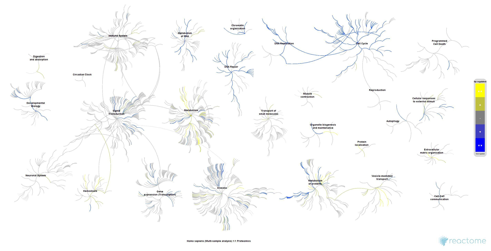

<!---
- Compile from command-line
Rscript -e "rmarkdown::render('exprAnalysisRNAseq.Rmd', c('html_document'), clean=TRUE)"
-->

# Introduction 

This tutorial provides an introduction to RNA-Seq analysis, focusing on a
paired RNA-seq experiment that investigates the impact of COVID-19 vaccination.
The dataset, RNA-seq Study of COVID-19 Vaccination [@Odak2024-wy], contains
gene-level read counts from blood samples collected before (Pre) and 24 hours
after (Post) mRNA COVID-19 vaccination from the same individuals. This paired
design allows for direct comparison of gene expression changes within each
person. The pre-generated gene-level read counts from this data set will be downloaded
from the corresponding GEO entry: [GSE247401](https://www.ncbi.nlm.nih.gov/geo/query/acc.cgi?acc=GSE247401).

We anticipate the results will show activation of immune-related genes,
particularly those involved in interferon response and antiviral defense,
consistent with findings from the original study.

The analysis workflow includes the following steps: 

1. Downloading gene-level read counts from GEO 
2. Identification of differentially expressed genes (DEGs) 
3. Visualizing expression results with volcano plots and heatmaps 
4. Result interpretation with GO and Reactome pathway enrichment analysis

__Why RNA-seq is a powerful tool in biology?__

RNA-seq enables scientists to simultaneously measure the expression of all
genes in a sample. By comparing gene activity across different conditions
(e.g., before and after vaccination, healthy vs. diseased tissue, or
environmental stress), researchers can identify activated or deactivated
biological processes. This bridges the gap between molecular changes and
observable outcomes such as immune activation, disease resistance, or
developmental shifts, transforming thousands of gene read counts into testable
biological insights.

__Learning Outcomes__

Through this activity, students will gain an understanding of how RNA-seq measures
gene expression changes and reveals biological responses, specifically in the
context of vaccination.

By working with the GSE247401 dataset, students will:

1. Comprehend how RNA-seq data reflects the activity of thousands of genes across samples.
2. Learn how statistical tools like DESeq2 identify significant gene changes between conditions.
3. Gain practical experience with real count data, normalization techniques, and visualization methods (PCA, volcano plots, heatmaps).
4. Connect computational results to biological understanding by exploring activated genes and pathways after vaccination.
5. Appreciate the process of converting large raw RNA-seq data files into meaningful insights, such as identifying immune and antiviral responses in blood following vaccination.

## Initialize project 

To get started with [Posit/RStudio Cloud](https://posit.cloud/), users can
follow the instructions below. Instead of Posit Cloud, more advanced users can
install everything on their local computer by first installing R from
[CRAN](https://cran.r-project.org), and then the free version of Posit/RStudio
from [here](https://posit.co/download/rstudio-desktop/). Since the usage of
Posit/RStudio Cloud does not require any local software installs, this method
is recommended for users who are new to R. For more advanced users the local
install option is less restrictive and more flexible. In both cases the user
interfaces are extremely similar and the way to run R code is nearly identical. 

### Load project via assignment link

1. Create a free personal account on Posit (RStudio) Cloud
   [here](https://posit.cloud/). 
2. Next click the <span style="background-color: #f1c40f;">Posit/RStudio Studio Cloud assignment link</span></a> provided under the same name
   coding on the corresponding assignment page on Canvas
   [here](https://elearn.ucr.edu/courses/192776/assignments/925649). Note,
   the latter page is private to this class.
3. Start the pregenerated assignment by clicking the `BIOL119-2025-SA5-HW`. This will create a copy of the assignment in a student's account.  
4. Continue under section 1.2 and skip R package install under section 2.

## Load R code and run it

The R code along with the human readable text in this document can be opened
and executed as follows:

1. Open source `Rmd` file for this document by selecting in top menu: `File` ->
   `Open File` -> `exprAnalyisRNAseq.Rmd`. Alternatively, one can click the name of this 
   file in Posit's (RStudio's) file browser, usually located in the window on the bottom right. Either option
   will open the `Rmd` in the code editor window usually located in the top left window.
2. Execute code of the `Rmd` file line by line by placing the cursor on a line of R code 
   and then pressing on the keyboard `Ctrl + Enter`. This will send the corresponding code line
   to the R console (located on bottom left) and execute (run) the code. It is important to execute the
   lines in the order given in the `Rmd` file. Note, `Rmd` files are special `R` files that contain 
   both human readable text in markdown format as well as R code located in so called code chunk boxes 
   that are initialized and terminated with a tag line starting with three backtick (\`) characters. If an 
   `R` script instead of an `Rmd` script is used then everything works the same. However, 
   in an `R` script human readable text has to be initialized on each line with a comment (`#`) sign.

Alternatively, one can execute all code in this document at once simply by
pressing the triangle next to the Knit button above the code editor window in
RStudio, and then selecting `Knit to HTML`. This will not only execute the
code, but also regenerate this HTML document and update all output, tables and
figures generated by the evaluated R code chunks accordingly.  Similarly, one
can generate a PDF document instead. The environment that makes this possible
is called [R Markdown](https://rmarkdown.rstudio.com/).

# Import Libraries

R packages required for this exercise will be loaded with the `library`
command. To suppress verbose messages during the package loading process, the
`suppressPackageStartupMessages` is used.

```{r chunk1, eval=TRUE, message=FALSE}
suppressPackageStartupMessages({
  library(SummarizedExperiment)
  library(DESeq2)
  library(edgeR)
  library(gplots)
  library(pheatmap)
  library(ReactomePA)
  library(clusterProfiler)
  library(enrichplot)
  library(org.Hs.eg.db)
  library(ggplot2)
})
```

Custom functions required for the following analyses are loaded with the `source` command from an R file
named `phyloAnalysis_Fct.R`.

```{r chunk2, eval=TRUE, message=FALSE}
source("exprAnalysisRNAseq_Fct.R")
```

# Variable Settings

The following sets up the basic information for the RNA-seq analysis.
It doesn’t analyze any data yet, it just defines variables that tell R which
dataset to download, where to save results, and how to modify sample
lables so that they are easy to recognize.

```{r chunk3, eval=TRUE, message=FALSE}
acc          <- "GSE247401" # Defines RNA-Seq data set to download
pre_pat      <- "V3D0$" # Sample tag for pre
post_pat     <- "V3D1$" # Sample tag for post
n_pairs      <- 4 # Number of pairs to choose, not all for simplicty
download_dir <- "data/exprAnalysisRNAseq" # Download directory
out_prefix   <- "GSE247401_V3_pre_vs_post_4pairs" # Prefix to use in file names of results 
result_dir   <- "results/exprAnalysisRNAseq/" # Where to write result files
```

# Load counts from GEO 

This section loads the RNA-seq count data from GEO and then selects the
specific samples to compare: the Pre vs Post vaccination pairs. It
also creates a metadata table (`coldata`) describing each sample for later use in
the differential gene expression (DEG) analysis with `DESeq2`. Students new to 
R and RNA-Seq analysis want to pay mainly attention to the resulting `coldata` table 
that is printed at the end.

```{r chunk4, eval=TRUE, message=FALSE}
cts <- geo_counts_gq(acc, download_dir = download_dir) # Downloads the gene count data
samples <- colnames(cts) # Lists all sample names (column names)
pre   <- grep(pre_pat, samples, value = TRUE) # Pre-vacc. samples with above pattern V3D0
post  <- sub(pre_pat, sub("\\$", "", post_pat), pre, perl = TRUE) # Matches Pre to Post samples 
ok    <- post %in% samples # Checks presence of post sample names 
pre   <- head(pre[ok],  n_pairs) # Keeps only first pairs (here 4)
post  <- head(post[ok], n_pairs) # Same for post

cts_small <- cts[, c(pre, post), drop = FALSE] # Subsets count matrix to paired samples
coldata   <- data.frame( # Builds a sample information table
  row.names = colnames(cts_small),
  subject   = factor(sub("_(V[23]D[01])$", "", c(pre, post), perl = TRUE)),
  time      = factor(c(rep("pre", length(pre)), rep("post", length(post))), levels = c("pre", "post"))
)
coldata # Displays the resulting metadata table
```

# DEG Analysis with `DESeq2`

This part runs the differential gene expression analysis using DESeq2, which
compares expression levels after vaccination (Post) vs before vaccination (Pre)
while accounting for the fact that the same people were sampled twice (paired
design). 

This code fits a paired statistical model that identifies genes whose
expression changes significantly 24 hours after vaccination, while controlling
for individual differences between participants. The output table (`res_tbl`)
contains one row per gene with its fold change and adjusted p-value, the
foundation for the plots and enrichment analysis that follow.

```{r chunk5, eval=TRUE, message=FALSE}
dds <- DESeqDataSetFromMatrix(cts_small, coldata, design = ~ subject + time)
dds <- dds[rowSums(counts(dds)) >= 10, ]
dds <- DESeq(dds)
res <- results(dds, contrast = c("time", "post", "pre"))
if (requireNamespace("apeglm", quietly = TRUE)) { cf <- resultsNames(dds)[grep("^time_post", resultsNames(dds))][1]; if (!is.na(cf)) res <- lfcShrink(dds, coef = cf, type = "apeglm") }
res_tbl <- as.data.frame(res)
```
The following paragraph gives a short explanation for each code line in the above code chunk. 
Beginners can ignore this level of detail.

_[Line 1]_ Creates a DESeq2 dataset object combining the count data and sample
information. The `design = ~ subject + time` formula tells `DESeq2` to control
for differences between subjects (subject) and test the main effect of time
(pre vs post). _[Line 2]_ Removes genes with very low total counts (fewer than
10 reads across all samples). These genes do not provide reliable statistical
signals. _[Line 3]_ Runs the full DESeq2 workflow: normalization, dispersion
estimation, and model fitting for each gene. _[Line 4]_ Extracts the comparison
results for Post vs Pre vaccination giving log₂ fold changes and adjusted
p-values for every gene. _[Line 5]_ Optionally applies log fold-change
shrinkage using the apeglm method, which reduces noise for genes with low
counts and makes fold changes more stable and interpretable. _[Line 6]_
Converts the DESeq2 results object into a regular data frame so we can easily
filter, plot, and annotate it later.


## Annotate DESeq2 results table

This section adds biological meaning to the `res_tbl` fron `DESeq2` by adding
additional gene identifiers (gene symbols and Entrez IDs) and their functional
descriptions. It connects the statistical results back to biological names,
saves them for reporting, and produces a normalized expression matrix
(`vsd_mat`) that will be used for clustering and heatmap visualization in the
next steps.

```{r chunk6, eval=TRUE, message=FALSE}
res_annot <- annotate_genes_simple(res_tbl)  # adds gene symbols and functional description
write.csv(res_annot, # Writes full result table to a file 
          paste0(result_dir, out_prefix, "_DESeq2_results_annotated.csv"),
          row.names = FALSE)
res_tbl$gene <- rownames(res_tbl) # Extracts gene IDs from row name slot 
res_tbl <- res_tbl[order(res_tbl$padj), ] # Sorts by adjusted p-value
vsd_mat <- assay(vst(dds, blind = TRUE)) # See below
```

The last line (with `assays`) creates a variance-stabilized expression matrix
for visualization. This transformation (`vst`) removes large differences due to
sequencing depth and makes expression values more comparable between samples.


## Filter DEGs 

This code block filters the `DESeq2` results, identifying
significantly changed genes based on robust biological and statistical
criteria. Specifically, it isolates genes exhibiting a fold change
exceeding 2 (or 1 on log2 scale) and an adjusted p-value below 0.05. This 
process yields a list of differentially expressed genes (DEGs) that are strongly and
significantly altered between Post and Pre-vaccination states. This DEG list
will be used for downstream applications such as heatmap plotting and functional
interpretation analyses, including GO or Reactome enrichment.

```{r chunk6a, eval=TRUE, message=FALSE}
sig_genes <- subset(res_annot, abs(log2FoldChange) > 1 & padj < 0.05)
DT::datatable(sig_genes, options = list(scrollX = TRUE))
```
The number of DEGs passing this filter is `r nrow(sig_genes)`.


# Visualize DEGs: Volcano Plot

A volcano plot is a simple way to visualize which genes change most strongly
and significantly after vaccination. In this experiment, each point on the plot
represents one gene measured in blood before and 24 hours after the COVID-19
vaccination. 

+ The x-axis shows the log₂ fold change, how much a gene’s
expression increases or decreases after vaccination. Genes on the right side are upregulated (expressed more strongly after
vaccination). 

+ Genes on the left side are downregulated (expressed less strongly after
vaccination).

+ The y-axis shows the –log₁₀(adjusted p-value) — how statistically significant
each change is.

+ The higher a point appears, the more confidently that gene is considered to
have changed.

In this study, the red dots toward the top-right of the plot correspond to
immune and interferon-related genes that became more active after vaccination,
reflecting the body’s early antiviral and immune response. The blue points
(top-left) represent genes that were reduced in expression, often involved in
normal housekeeping functions that temporarily slow down during immune
activation.

```{r chunk7, eval=TRUE, message=FALSE}
res_for_labels <- res_annot # Usage of gene symbols in plot
res_for_labels$gene <- ifelse(is.na(res_for_labels$symbol), res_for_labels$gene, res_for_labels$symbol)
volcano_simple(res_tbl,
               alpha = 0.05, lfc = 1, label_n = 10,
               device = "screen",
               out = paste0(out_prefix, "_DESeq2"),
               title = "DESeq2: Post vs Pre Vaccination")
```

# Clustering and Heatmap

This code produces a heatmap, a visual summary showing how the normalized
expression of the top 30 most significantly changed genes differs before and
after vaccination across all participants. It visually confirms that
vaccination triggers a coordinated activation of immune genes, while overall
variability between individuals remains controlled by using a paired
experimental design. To identify expression patterns, the subsetted matrix is
then subjected to hierarchical clustering, which groups together genes and
samples with similar expression patterns. The resulting heatmap displays both
row-wise (gene) and column-wise (sample) dendrograms, showing how genes and
samples cluster based on Pearson correlation. The cell colors represent
relative expression levels after row-wise scaling (scale = "row"), which
enhances contrast and makes it easier to see which genes are up- or
down-regulated in each sample. In this COVID-19 vaccination dataset,
post-vaccination samples tend to cluster together due to coordinated activation
of immune and interferon-related genes. Users interested in the underlying
clustering methods can explore additional R tutorials on hierarchical
clustering and heatmap visualization.

```{r chunk7a, eval=TRUE, message=FALSE}
# Heatmap with Pearson correlation for rows AND columns using pheatmap
library(pheatmap)

# 1) VST (DESeq2) expression matrix
vsd_mat <- assay(vst(dds, blind = TRUE))

# 2) Top genes by adjusted p-value (DESeq2 results)
res_tbl$gene <- rownames(res_tbl)
sel <- head(res_tbl$gene[order(res_tbl$padj)], 30)
sel <- sel[sel %in% rownames(vsd_mat)]
stopifnot(length(sel) >= 2)

mat <- vsd_mat[sel, , drop = FALSE]

# 3) Clear column labels (Subject_Time) so pairs are visible
colnames(mat) <- paste(coldata$subject, coldata$time, sep = "_")

# 4) Sample annotations (column side bar)
annotation_col <- data.frame(
  time    = coldata$time,
  subject = coldata$subject,
  row.names = colnames(mat)
)

# Optional: custom colors for 'time'
ann_colors <- list(
  time = c(pre = "#3182BD", post = "#E41A1C")
  # subject can be colored too, but often many levels → let pheatmap auto-pick
)

# 5) pheatmap with Pearson on both axes (distance = "correlation")
# note mat used here: is DESeq2’s variance-stabilized, log₂-scaled expression values
pheatmap(mat,
         scale = "row",                           
         clustering_distance_rows = "correlation",
         clustering_distance_cols = "correlation",
         clustering_method = "complete",
         annotation_col = annotation_col,
         annotation_colors = ann_colors,
         show_rownames = TRUE,
         show_colnames = TRUE,
         fontsize_row = 7,
         fontsize_col = 9,
         main = "DESea2: Top 30 DE genes (Pearson clustering on rows & columns)",
         border_color = NA)
```

# GO Term Enrichment Analysis

This section performs GO Term enrichment analysis with functions provided by
the `clusterProfiler` package. Initially, it filters the `DESeq2` results to
significant, biologically large changes (`|log₂FC| > 1 and FDR < 0.05`), converts
that DEG list to Entrez IDs, and performs Gene Ontology Biological Process (GO
BP) enrichment with the `enrichGO` function. The enrichment tests whether DEGs
are over-represented in specific biological processes compared with the
background of tested genes; for this vaccination dataset. Based on the
experimental design, one should expect terms related to innate immunity,
interferon signaling, antiviral defense, and cytokine responses. The final
barplot displays the top 10 enriched processes by significance, helping to
summarize which biological programs are most activated post-vaccination. 

```{r chunk8, eval=TRUE, message=FALSE}
degs <- subset(res_annot, abs(log2FoldChange) > 1 & padj < 0.05)
degs <- na.omit(sig_genes$entrez_id)
ego_bp <- enrichGO(gene = degs, OrgDb = org.Hs.eg.db, keyType = "ENTREZID", ont = "BP")
barplot(ego_bp, showCategory=10)
```

# Pathway Enrichment Analysis

This code performs a Reactome pathway enrichment analysis, which helps identify
biological pathways that are significantly affected by the genes changing after
vaccination.

First, it selects the significant genes (`sig_de`) that meet both a fold change
cutoff (|log₂FC| ≥ 1) and an adjusted p-value < 0.05, then extracts their
Entrez IDs (`entrez_sel`), which are the standardized identifiers required by
most enrichment tools. Next, it defines a background universe (`bg_universe`),
the set of all genes that were tested in the experiment to ensure that
enrichment results are statistically well-calibrated. The `enrichPathway`
function (from the ReactomePA package) then checks whether the significant
genes are overrepresented in specific Reactome pathways compared with this
background. These pathways correspond to curated molecular systems such as
Interferon Signaling, Cytokine Signaling, or Antiviral Mechanisms. Finally,
`setReadable` converts the Entrez IDs back to human-readable gene symbols,
making the enrichment results easier to interpret.

In summary, this code identifies which biological pathways are most strongly
activated or repressed after COVID-19 vaccination, revealing the coordinated
immune responses behind the differential gene expression results.

```{r chunk9, eval=TRUE, message=FALSE}
degs <- subset(res_annot, abs(log2FoldChange) >= 1 & padj < 0.05)
entrez_sel <- unique(na.omit(degs$entrez_id))
bg_universe <- unique(na.omit(res_annot$entrez_id))
er <- enrichPathway(gene = entrez_sel, organism = "human", pAdjustMethod = "BH", pvalueCutoff= 0.05, qvalueCutoff  = 0.05, universe = bg_universe, readable = FALSE)
er_readable <- setReadable(er, OrgDb = org.Hs.eg.db, keyType = "ENTREZID")
```

Next, the enrichment resuls are plotted as dot and bar plots. Here is a short
description for interpreting these plots and what they mean for this vaccination 
study:

Dot plot (`dotplot`): Each row is a Reactome pathway; the x-axis shows the
GeneRatio (fraction of significant genes that fall in that pathway), the
dot size shows the Count (how many DE genes hit the pathway), and the dot color
encodes adjusted p-value (often a gradient where darker/warmer = more
significant after multiple-testing correction). Pathways toward the right with
large, dark dots are enriched in DEGs, such as Interferon Signaling.

Bar plot (`barplot`): Shows the top pathways ranked by enrichment; the bar length
is typically the Count (number of DE genes in each pathway), and bars may be
colored by adjusted p-value. Long bars near the top indicate pathways with the
highest enrichment. Seeing multiple, related immune pathways
(e.g., interferon, antigen presentation) near the top confirms a coordinated
early innate response consistent with the study design (Post vs Pre within the
same people).

Interpretation tips: Focus on pathways that are (1) highly significant (strong
color), (2) involve many DE genes (big dots/long bars), and (3) make biological
sense together (immune/antiviral clusters). Remember that pathways overlap, thus 
one should use them as themes rather than isolated entities.

```{r chunk9b, eval=TRUE, message=FALSE, fig.height=8}
dotplot(er_readable, showCategory = 20, font.size = 10) + ggtitle("Reactome pathway enrichment")
barplot(er_readable, showCategory = 20, font.size = 10) + ggtitle("Reactome (top pathways)")
```

# Browse Pathways in Reactome

The following command can be used to visually explore the biology behind the
statistical results of this analysis workflow, linking the identified DEG list to 
a real molecular network inside the [Reactome](https://reactome.org/) database.

In detail, the command automatically opens the Reactome Pathway Browser in as user's web
browser for one of the top enriched pathways identified in the analysis. The
object `top_path` stores the Reactome pathway ID (for example, R-HSA-913531 for
Interferon Signaling). When running this command, it builds the full URL to
that pathway and tells R to open it, similar to clicking a link.

Once the page opens, one can see an interactive diagram showing how different
molecules and genes interact in that pathway. Each node or reaction represents
a protein, gene product, or biological event, and one can hover or click to
read detailed descriptions. If this pathway came up as significantly enriched
in the results, it means that many of the genes activated after vaccination
participate in that biological process. When explorint these pathways, one
should look for:

+ where significant genes appear,
+ whether most are up-regulated (immune activation) or down-regulated
+ how these changes fit the experiment’s goal—here, understanding how vaccination triggers the body’s early antiviral response

```{r chunk9c, eval=TRUE, message=FALSE}
top_path <- er_readable@result$ID[1]
browseURL(paste0("https://reactome.org/PathwayBrowser/#/", top_path))
```

The following shows all human pathways in Reactome as a fireworks plot. This is a static 
image not created by the above code directly. 



# References

