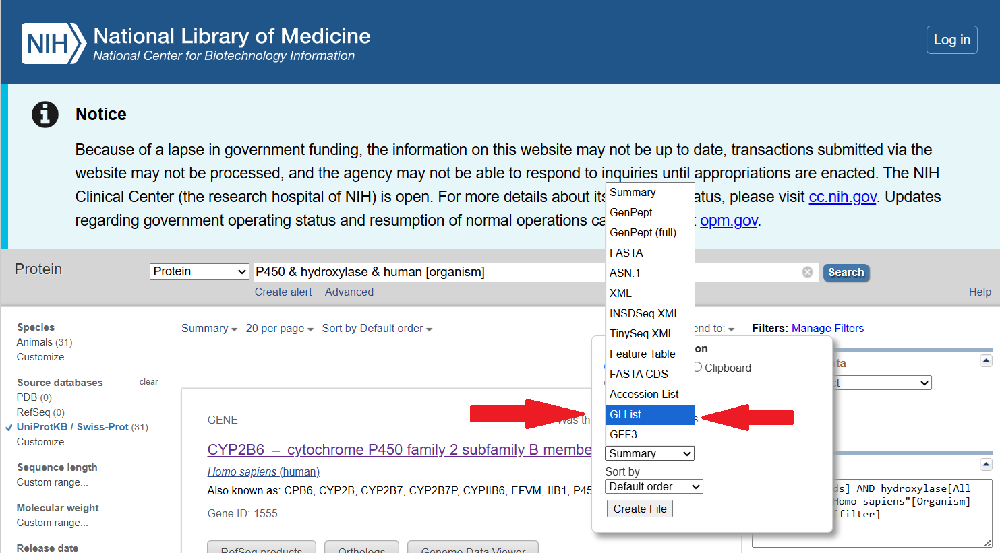

<!---
- Compile from command-line
Rscript -e "rmarkdown::render('phyloAnalysis.Rmd', c('html_document'), clean=FALSE)"
-->

# Introduction

This tutorial covers a basic phylogenetic analysis in R including the following steps. It starts with an external website query, followed by all subsequent steps in R.

1. NCBI query to retrieve sequence IDs 
2. Sequence batch download
3. Cration of multiple sequence alignment
4. Building phylogentic tree with bootstrap analysis
5. Tree visualization


# Creation of Input File

The following queries NCBI's protein database to retrieve the protein IDs of all Cytochrome P450 Hydroxilases from human that are present in UniProt.

 - Go to **[NCBI Protein](http://www.ncbi.nlm.nih.gov/protein)**, and run the following query: `P450 & hydroxylase & human [organism]`
 - Select under “Source databases” **UniProtKB/SwissProt** as database.
 - Save a *list of identifiers* (**GI List**) to your desktop via the "Send to" File drop down menu.

Note, the abbreviation "GI" often stands for "Gene ID".  However, these are *not* Entrez Gene IDs.  Instead, it is more appropriate to consider these "Protein IDs."

Because this is a deviation from SA2 (creation of identifier list *instead* of FASTA file), this screenshot helps illustrate the novel step:



The result is a `sequence.gi` file.

# Import Libraries
R packages required for this exercise will be loaded with the `library` command. To suppress verbose messages during the package loading process, the `suppressPackageStartupMessages` is used.

```{r example1, eval=TRUE, message=FALSE}
suppressPackageStartupMessages({
	library(rentrez)
	library(Biostrings)
	library(org.Hs.eg.db)
	library(seqinr)#to create intermediate FASTA file
	library(msa)
	library(ape)
	library(phangorn)
	library(pheatmap)
    library(msaR)
})
```

Custom functions required for the following analyses are loaded with the `source` command from an R file
named `phyloAnalysis_Fct.R`.
```{r example1_fct, eval=TRUE, message=FALSE}
source("phyloAnalysis_Fct.R")
```

# Import Sequences 

Using the protein IDs obtained from the NCBI query in the previous step, the `rentrez` package is 
used to import the corresponding P450 protein sequences into R.

```{r example2, eval=TRUE, message=FALSE}
result_ID_file <- "data/phyloAnalysis/sequence.gi"
gene_IDs <- geneID_wrapper(result_ID_file)
```
Since P450s are named by subfamilies, the corresponding gene symbols are
used as labels of the protein sequences. The gene symbols are obtained by querying the
`org.Hs.eg.db` data package. This way it is easier to assess whether the
P450 subfamilies cluster together in the downstream phylogenetic trees. 

```{r example3, eval=TRUE, message=FALSE}
gene_symbols <- mapIds( x = org.Hs.eg.db, keys = gene_IDs, column = "SYMBOL", keytype = "ENTREZID")
FASTA_file <- "rentrez-P450_UniProtKB_SwissProt-gene_symbol.fasta" # Name of output fasta file
FASTA_symbol_wrapper(result_ID_file, gene_symbols, FASTA_file)
```

# Multiple Sequence Alignment

The `msa` package in Bioconductor [@Bodenhofer2015-yj] offers access to three multiple alignment software tools: ClustalW [@Thompson1994-yq], Clustal Omega [@Sievers2011-bj], and MUSCLE [@Edgar2004-sn].

Multiple Sequence Alignments (MSA) are commonly represented using the "clustal" alignment format or the gapped FASTA format. This document utilizes Clustal Omega to generate the MSA for the downloaded P450 sequences due to its more recent implementation.

For an alternative approach, the web version of Clustal Omega can be accessed [here](https://www.ebi.ac.uk/jdispatcher/msa/clustalo).

However, using the provided R code offers several benefits beyond reproducibility. These include programmability, automation for large scale analyses, and increased flexibility.

The following steps create a multiple alignment for the downloaded P450 protein
sequences. The output, a gapped FASTA file named `p450msa.fasta`, is saved in the
data/phyloAnalysis/ directory. After importing this file, the multiple
alignment is interactively displayed using the `msaR` package. This interactive
display is highly beneficial for inspecting the alignment, as it also features
a sequence logo representation to illustrate residue conservation in each
column. Moreover, one can change the color scheme under the `Color scheme` menu. 
For instance, the `"PID"` scheme is a good choice to highlight highly conserved areas.
Scrolling right reveals the Prosite motif [PS00018](https://prosite.expasy.org/PDOC00081) 
for P450 sequences, approximately located in columns 602 to 620. Also pay attention
that multiple alignments are stored here as `AAMultipleAlignment` that allows to 
subset them columnwise. How to do this is given in the line that creates the `msa_bios_sub`
object. 

```{r example4a, eval=TRUE, message=FALSE}
P450_SeqObj <- readAAStringSet(FASTA_file)
msa_ClustalOmega <- msa(P450_SeqObj, method = "ClustalOmega")
msa_ClustalOmega.ape <- msaConvert(msa_ClustalOmega, type="ape::AAbin") #conversion of R object for next step
Biostrings::writeXStringSet(Biostrings::unmasked(msa_ClustalOmega), "data/phyloAnalysis/msa.fasta")
msa_bios <- readAAMultipleAlignment("data/phyloAnalysis/msa.fasta", format="fasta")
msa_bios_sub <- AAMultipleAlignment(AAStringSet(apply(as.matrix(unmasked(msa_bios))[,10:50], 1, paste0, collapse="")))
msaR::msaR(Biostrings::unmasked(msa_bios))
```

# Create and Visualize Distance Matrix

## Compute Distance Matrix
To perform downstream clustering-based tree building, a distance matrix must
first be computed from the multiple alignment. This is achieved using the
`dist.aa` function from the `ape` package. __Note:__ The distance matrix is
created in this step mainly for demonstration purposes. The below tree building
functions are not using it as input since they create the required distance
matrix internally on the fly.

```{r example5, eval=TRUE, message=FALSE}
msa_ClustalOmega.dist <- dist.aa(msa_ClustalOmega.ape, pairwise.deletion = FALSE, scaled = FALSE)
```

## Inspect Distance Matrix

The distance matrix can be inspected by converting it into a `matrix` with the `as.matrix` function.
The second line below outputs a small slice of the distance matrix (restricted to
first 4 row and columns), and the third line demonstrates how to obtain the distance
value for a specific squence pair, here "CYP8B1" and "CYP7B1".

```{r example5a, eval=TRUE, message=FALSE}
mymatrix <- as.matrix(msa_ClustalOmega.dist)
mymatrix[1:4, 1:4]
mymatrix["CYP8B1", "CYP7B1"]
```

## Visualize Distance Matrix

An efficient way to inspect distance matrices visually is to create a heatmap.
The `pheatmap` function is used for this. In the resulting plot, colors
represent the distance values, and the order of the rows and columns is
adjusted according to distance trees.

```{r example5b, eval=TRUE, message=FALSE}
pheatmap(as.matrix(msa_ClustalOmega.dist))
```

# Phylogenetic Tree with Bootstrap

Phylogenetic analysis is performed by the `ape` and some other helper
packages [@Paradis2004-vj]. The `ape` package offers various methods 
for tree construction, including the Unweighted Pair Group Method with
Arithmetic Averages (UPGMA) [@sokal1958statistical] and Neighbor-Joining 
(NJ) [@Saitou1987-xl]. This section introduces both of these
tree building methods.

## UPGMA Tree
The follwing imports the multiple alignment of P450 protein sequences and
converts it to a matrix. Using the `phangorn` package, pairwise evolutionary
distances are computed under a standard amino acid substitution model such as
JTT, and the ape package then applies the UPGMA (Unweighted Pair Group Method
with Arithmetic Mean) algorithm to cluster sequences into a rooted cladogran
(ultrametric tree if sequences evolve clockwise). To evaluate the reliability 
of the branches, a bootstrap analysis repeatedly resamples alignment columns, 
rebuilds the tree, and counts how often each grouping reappears. These percentages 
are added to the nodes as bootstrap support values. The number of bootstrap repetitions
can be specified under the `B` argument (for real analyses use larger values, e.g. `B=1000`). 
Finally, the tree is plotted with
bootstrap values indicating the confidence in each inferred relationship.
The `upgma_bootstrap_aa` that performs this analysis only requires the multiple 
alignment as input. The distance matrix is recomputed by the function on the fly.

```{r example6, eval=TRUE, message=FALSE}
msa_bios <- readAAMultipleAlignment("data/phyloAnalysis/msa.fasta", format="fasta")
m  <- as.matrix(unmasked(msa_bios))   
tree_upgma <- upgma_bootstrap_aa(m, B = 100, model = "JTT")
plot_tree_bootstrap(tree_upgma, cutoff = 70, main = "")
```

## Neighbor-Joining (NJ) Tree
This part of the exercise demonstrates how to build a Neighbor-Joining (NJ)
phylogenetic tree from the same P450 protein alignment that was used for the UPGMA
analysis. For this, the aligned amino acid sequences are imported and converted into a
matrix format as before. Using the phangorn package, a distance matrix is computed under a 
substitution model such as JTT, which estimates how many amino acid substitutions separate each
pair of sequences. The `nj` function from the `ape` package is used to constructs an unrooted
Neighbor-Joining tree, which differs from UPGMA because it does not assume a
constant evolutionary rate across lineages (no molecular clock). To assess the
reliability of each branch, a bootstrap analysis is performed: the alignment
columns are resampled many times, the NJ tree is rebuilt for each replicate,
and the frequency with which each grouping reappears is recorded as a bootstrap
percentage. The number of bootstrap repetitions can be specified under the `B` argument.
The resulting values are included in the internal branches of the
consensus NJ tree. Because NJ produces an unrooted tree, it is then rooted
either by the midpoint method (placing the root halfway between the two most
distant tips) or by specifying a known outgroup sequence. In this example the only the
midpoint method is used. How to perform rooting with an outgroup is show but 
not evaluated. The final plot displays branch lengths proportional to evolutionary 
distance and bootstrap percentages that indicate how strongly each clade is supported by the data.


```{r example7, eval=TRUE, message=FALSE}
msa_bios <- readAAMultipleAlignment("data/phyloAnalysis/msa.fasta", format="fasta")
m  <- as.matrix(unmasked(msa_bios)) 
tree_nj <- nj_bootstrap_aa(m, B = 100, model = "JTT")
# Midpoint rooting 
tree_nj_rooted <- phangorn::midpoint(tree_nj)
# Outgroup rooting 
# tree_nj_rooted <- ape::root(tree_nj, outgroup = "YourOutgroupName", resolve.root = TRUE)
plot_tree_bootstrap(tree_nj_rooted, type="phylogram", cutoff = 70, main = "")
```

Different tree shapes can be specified under the `type` argument of the `plot_tree_bootstrap` function.
This is a custom function that uses internally the `plot.phylo` function of the `ape` package. To find
out which tree styles are available, open its help with `?plot.phylo` and look up under the `type`
argument the available options. The below creates, in addition to the above phylogram, a fan-shaped tree 
by specifying `"fan"` under the type argument.

```{r example7b, eval=TRUE, message=FALSE}
plot_tree_bootstrap(tree_nj_rooted, type="fan", cutoff = 70, main = "")
```

# Study Material for Homework

__Lecture LA6__

 - UPGMA / NJ Implementation
 - UPGMA / NJ Assumptions
 - Bootstrapping Support for Tree Generation
   
__Procedures from this assignment (SA4)__

 - Basic R Functions / Syntax
 - Descriptive Statistic Calculations in R
 - Knowledge of Commonly Used Functions from R Libraries

# Session Info

```{r sessionInfo}
sessionInfo()
```


# References
